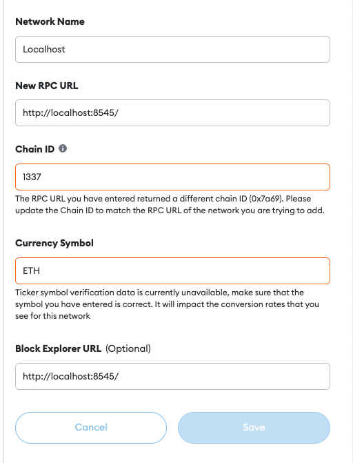

<h1 align="center">
  <br>
  LOGO
  <br><br>
  Adminpro - Backend
  <br>
</h1>
<h4 align="center">Stake Together</h4>


## Getting started (frontend)

```
cd frontend
npm install
npm start
```


## Run locally

`NOTE: Make sure that you have foundry installed`

1. Run anvil node in a new terminal.
```sh
  $ anvil
```

2. Run `local.sh` and deploy contracts.
```sh
  $ ./local.sh
```

3. Run frontend from ``frontend``.
```sh
$ cd frontend
$ yarn
$ yarn start
```

4. Add localhost connection to metamask.

* Network name: **Localhost**
* New RPC URL: **http://localhost:8545/**
* Chain ID: **1337**
* Currency Symbol: **ETH**
* Block Explorer URL: **http://localhost:8545/**



5. Switch network to localhost on metamask.


## Get some ETH locally
Call this script with your metamask wallet address
```sh
  WALLET=*|your wallet here|* AMOUNT=*|amount in eth|* forge script ./script/GetEth.s.sol --rpc-url http://127.0.0.1:8545 --private-key 0x2a871d0798f97d79848a013d4936a73bf4cc922c825d33c1cf7073dff6d409c6 --broadcast
```